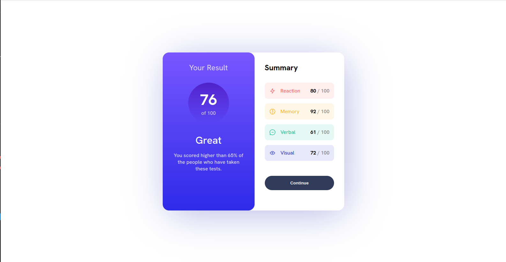
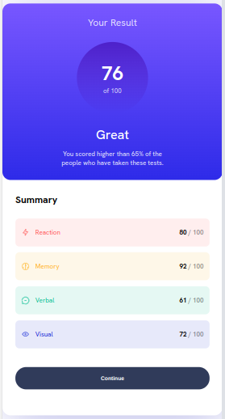

# Frontend Mentor - Results summary component solution

This is a solution to the [Results summary component challenge on Frontend Mentor](https://www.frontendmentor.io/challenges/results-summary-component-CE_K6s0maV). Frontend Mentor challenges help you improve your coding skills by building realistic projects. 

## Table of contents

- [Overview](#overview)
  - [The challenge](#the-challenge)
  - [Screenshot](#screenshot)
  - [Links](#links)
- [My process](#my-process)
  - [Built with](#built-with)
  - [Useful resources](#useful-resources)
- [Author](#author)

## Overview

### The challenge

Users should be able to:

- View the optimal layout for the interface depending on their device's screen size
- See hover and focus states for all interactive elements on the page
- **Bonus**: Use the local JSON data to dynamically populate the content

### Screenshot

### Links

- Solution URL: [Solution URL](https://www.frontendmentor.io/solutions/responsive-component-with-html-and-css-6tHeg09Tk1)
- Live Site URL: [Live site URL](https://ez-resultssummarycomp.netlify.app/)

## My process

### Built with

- Semantic HTML5 markup
- CSS custom properties
- Flexbox
- Mobile-first workflow

### Useful resources

- [linear gradient on mdn](https://developer.mozilla.org/en-US/docs/Web/CSS/gradient/linear-gradient ) - This helped me have a better grasp on linear gradient and its usage.

**

## Author

- Website - [Mamadou Faye](https://fayedev.com)
- Frontend Mentor - [@FayeDev97](https://www.https://www.frontendmentor.io/profile/FayeDev97)
